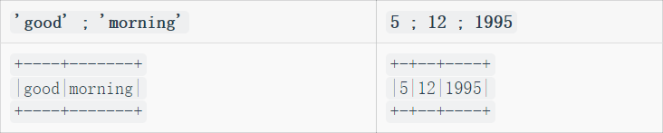
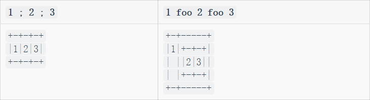
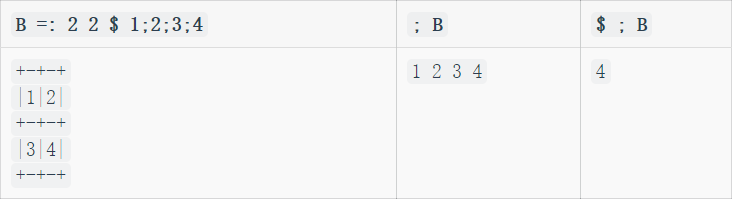
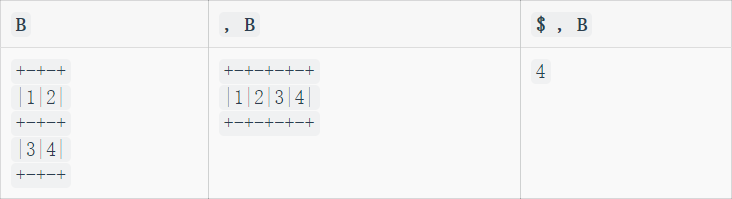
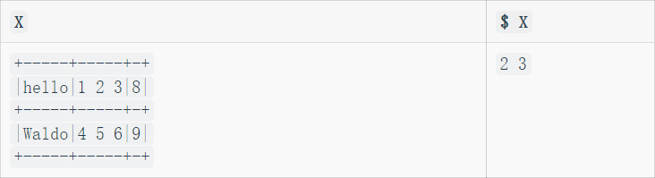

# 第五章：构建数组

这一章是关于构建数组的。首先，我们从列表中构建数组，之后我们将组接数组已生成更大的数组。

## 5.1 通过赋予列表外形构建数组
### 5.1.1 回顾

回顾一下在[第二章](chapter2.md)中提到的“项”的概念。数列的项是数字。表的项是它的行。三维数组的项是它的平面。

回忆一下`x $ y`将会生成一个数组，其中使用列表`y`提供项，用`x`提供外形。也就谁说列表`x`提供维度。下面是例子：

`2 2 $ 0 1 2 3`|`2 3 $ 'ABCDEF'`
---------------|---
`0 1`<br>`2 3` |`ABC`<br>`DEF`
 
如果列表`y`中所包含的项数少于所需，那么`y`中的项将被循环使用。也就是说数组可以构建成一些简单的模式，比如说所有元素都一样。

`2 3 $ 'ABCD'`|`2 2 $ 1`     |`3 3 $ 1 0 0 0`
--------------|--------------|---
`ABC`<br>`DAB`|`1 1`<br>`1 1`|`1 0 0`<br>`0 1 0`<br>`0 0 1`

“外形”动词，即双目的`$`，有一个伴生动词，“取外形”（单目的`$`）会产生一个维度列表，也就是其参数的外形。

`A =: 2 3 $ 'ABCDEF'`|`$ A`|`a =: 'pqr'`|`$ a`
---------------------|-----|------------|---
`ABC`<br>`DEF`       |`2 3`|`pqr`       |`3`

对于任何数组`A`，其维度列表`$ A`都是一个一维列表。因此`$ $ A`是一个只有一项的列表。然后`$ $ $ A`总是一个只包含`1`这项的列表。 

`A`           |`$ A`|`$ $ A`|`$ $ $ A`
--------------|-----|-------|---
`ABC`<br>`DEF`|`2 3`|`2`    |`1`

### 5.1.2 空数组

一个数组任意维度的长度都可以是零。一个长度是零——或者说是空的——的一个列表，可以通过将维度列表设置为`0`，然后用随意什么值作为它的项。
 
`E =: 0 $ 99`|`$ E`
-------------|---
` `|`0`

如果`E`是空的，它就不包含任何项，因此给它无论附加一个什么样的项，它将只有一项。

`E`|`$ E`|`w =: E ,98`|`$ w`
---------|------------|---
` `|`0`  |`98`        |`1`

类似的，如果`ET`是一个空表，没有任何行，但是有3列。那么如果给它附加一行，它就只有一行。

`ET =: 0 3 $ 'x'`|`$ E`|`$ ET , 'pqr'`
-----------------|-----|---
` `              |`0 3`|`1 3`
 
### 5.1.3 构建标量

假设我们需要构建一个标量。标量没有维度，也就是说，它的维度列表是空的。我们可以给出一个空列表做`$`的左参数来构建标量：

`S =: (0$0) $ 17`|`$ S`|`$ $ S`
`17`|` `|`0`
 
### 5.1.4 更通用的情况

我们认为`(x $ y)`使用`y`中的项来产生了一个`x`外形的数组。所以，通常情况`(x$y)`的外形并不仅仅取决于`x`，而是在`x`后面接上`y`中项的外形来构成的。

如果`y`是一个表格，那么`y`的项就是行，或者说是列表。在接下来的例子中，`Y`中项的外形是`Y`中行的长度，也就是`4`。

`X =: 2`|`Y =: 3 4 $ 'A'`          |`Z =: X $ Y`    |`$ Z`
--------|--------------------------|----------------|---
`2`     |`AAAA`<br>`AAAA`<br>`AAAA`|`AAAA`<br>`AAAA`|`2 4`

接下来的小节将通过组接已有的数组来构造新的。

## 5.2 附加(Appending)，末尾组接(Joining End-to-End)

回忆一下，任何一个数组都可以被看作项的列表，所以，对于表而言，它的项就是行。动词`,`(逗号)被称为“附加”。表达式`(x,y)`表示将`y`的项接在`x`后面形成的列表。

```
    B =: 2 3 $ 'UVWXYZ'
    b =: 3 $ 'uvw'
```

`a`  |`b`  |`a , b` |`A`           |`B`           |`A , B`
-----|-----|--------|--------------|--------------|---
`pqr`|`uvw`|`pqruvw`|`ABC`<br>`DEF`|`UVW`<br>`XYZ`|`ABC`<br>`DEF`<br>`UVW`<br>`XYZ`

在这上面这个例子`(A,B)`中，`A`的项是长度为3的列表，`B`也是。因此`A`和`B`的项具有相同的阶和长度。如果不是呢？在这种情况下“附加”动词会尽可能的延展一个参数一便使其和另一个参数相匹配。方法是是先使它们具有相同的阶，再扩充(padding)长度，并对标量进行重复(replicating)。下面是一个展示这个功能的例子。

### 5.2.1 调整为同阶

假设我们向表附加一个行。例如，考虑把三字符列表`b`(如上)附加到2行3列的表`A`(如上)来形成一个新的行。

`A`           |`b`  |`A , b`
--------------|-----|---
`ABC`<br>`DEF`|`uvw`|`ABC`<br>`DEF`<br>`uvw`

可以注意到，这里我们想要`b`的一项接在`A`的两项之后，但是`b`i不是一个单项。我们可以将`b`的外形调整为1行3列的表，也就是对`b`进行升阶。但这不是必须的，因为“附加”动词可以自动将低阶的参数调整为一项的数组，额外添加的维度大小均为一。

`A`           |`b`  |`A , (1 3 $ b)`        |`A , b`                |`b , A`
--------------|-----|-----------------------|-----------------------|---
`ABC`<br>`DEF`|`uvw`|`ABC`<br>`DEF`<br>`uvw`|`ABC`<br>`DEF`<br>`uvw`|`uvw`<br>`ABC`<br>`DEF`

### 5.2.2 扩充长度

当一个参数比另一个参数短时，将会被扩充长度。字符数组会填入空白字符，数字数组会填入零。

`A`           |`A , 'XY'`            |`(2 3 $ 1) , 9 9`
--------------|----------------------|---
`ABC`<br>`DEF`|`ABC`<br>`DEF`<br>`XY`|`1 1 1`<br>`1 1 1`<br>`9 9 0`

### 5.2.3 重复标量

“附加”的标量参数会被按需重复，以便于和另一个参数匹配。下面的例子中，标量`'*'`会被重复，而向量`(1 $ '*')`会被扩充。

`A`           |`A , '*'`              |`A , 1 $ '*'`
--------------|-----------------------|---
`ABC`<br>`DEF`|`ABC`<br>`DEF`<br>`***`|`ABC`<br>`DEF`<br>`*  `

## 5.3 拼接(Stitching)，边缘组接(Joining Side-to-Side) 

双目动词`,.`(逗号 点)被称为“拼接”。表达式`(x ,. y)`中，`x`中的每一项都会附加`y`中相应的一项，来得到结果中的项。

`a`  |`b`  |`a ,. b`            |`A`           |`B`           |`A ,. B`
-----|-----|--------------------|--------------|--------------|---
`pqr`|`uvw`|`pu`<br>`qv`<br>`rw`|`ABC`<br>`DEF`|`UVW`<br>`XYZ`|`ABCUVW`<br>`DEFXYZ`

## 5.4 层叠(Laminating)，层式组接(Joining Face-to-Face) 

动词`,:`(逗号 冒号)被称为“层叠”。`(x ,: y)`的结果总是一个两项的数组，其第一项是`x`第二项是`y`

`a`  |`b`  |`a ,: b`
-----|-----|---
`pqr`|`uvw`|`pqr`<br>`uvw`
 
如果`x`和`y`都是表，我们不难想象，其中一个表被放在另一个表上，形成一个3维数组，其第一维长度是2。 

`A`           |`B`           |`A ,: B`                            |`$ A ,: B`
--------------|--------------|------------------------------------|---
`ABC`<br>`DEF`|`UVW`<br>`XYZ`|`ABC`<br>`DEF`<br><br>`UVW`<br>`XYZ`|`2 2 3`

## 5.5 连接

动词`;`(分号)被称为“连接”。这是一个便捷的构建箱列表的方式。



可以看到例子`5;12;1995`展示出`(x;y)`不总表示`(< x),(< y)`。由于“连接”主要是为了构建箱列表，它会它的参数是不是已经为一个列表。如果我们定义一个动词来实现`(< x),(< y)`

```
    foo =: 4 : '(< x) , (< y)'
```

我们对比一下两者：



## 5.6 解构数组

我们已经见到了四个双目动词：“附加”`(,)`，“拼接”`(,.)`，“层叠”`(,:)`和“连接”`(;)`。它们中每一个都有单目情况，接下来将详细讲解。

### 5.6.1 摧毁(Razing) 

单目的`;`被称为“摧毁”。它会把参数开箱取出单独的元素，并将其组成列表。



### 5.6.2 展开(Ravelling)

单目的`,`被称为“展开”。它会将参数的元素分离，并组合成一个列表。



### 5.6.3 展开项(Ravelling Items)

单目的`,.`被叫做“展开项”。它将会展开其参数的每一项，从而组成一个表。

`k =: 2 2 3 $ i. 12`|`,. k`
--------------------|---
`0  1  2`<br>`3  4  5`<br><br>`6  7  8`<br>`9 10 11`|`0 1 2 3  4  5`<br>`6 7 8 9 10 11`

“展开项”可以很方便的将列展开为一列的表格。

`b`  |`,. b`
-----|---
`uvw`|`u`<br>`v`<br>`w`

### 5.6.4 单项化(Itemizing)

单目的`,:`被称为“单项化”。无论输入什么数组，它将会通过加一个长度为`1`的维度，来生成一个单项的列表。

`A`           |`,: A`        |`$ ,: A`
--------------|--------------|---
`ABC`<br>`DEF`|`ABC`<br>`DEF`|`1 2 3`

## 5.7 小数组和大数组

正如之前所见，数组可以使用`$`动词来构。

```
    3 2 $ 1 2 3 4 5 6
1 2
3 4
5 6
```

对于小数组，其内容可以在一行之内给出，就有`$`的替代品存在，可以不用显式标出维度。

`> 1 2 ; 3 4 ; 5 6`    |`1 2 , 3 4 ,: 5 6`
-----------------------|---
`1 2`<br>`3 4`<br>`5 6`|`1 2`<br>`3 4`<br>`5 6`

如果要构建一个大的表格，下面是一个可行的方法。首先定义一个“实用的”动词（这个动词对目前的目标很有用，但现在不需要研究其定义）

```
    ArrayMaker =: ". ;. _2
```

`ArrayMaker`的功能是从脚本的行中获得数据，一行行的构建一个数字表格。

```
    table =: ArrayMaker 0 : 0
1 2 3
4 5 6
7 8 9
)
```

`table`                      |`$ table`
-----------------------------|---
`1 2 3`<br>`4 5 6`<br>`7 8 9`|`3 3`

（关于`ArrayMaker`的工作原理，详见[第十七章](chapter17.md)）也可以用同样的方式从脚本构建一个箱数组。

```
    X =: ArrayMaker 0 : 0
'hello' ; 1 2 3 ; 8
'Waldo' ; 4 5 6 ; 9
)
```



第五章到此结束。
